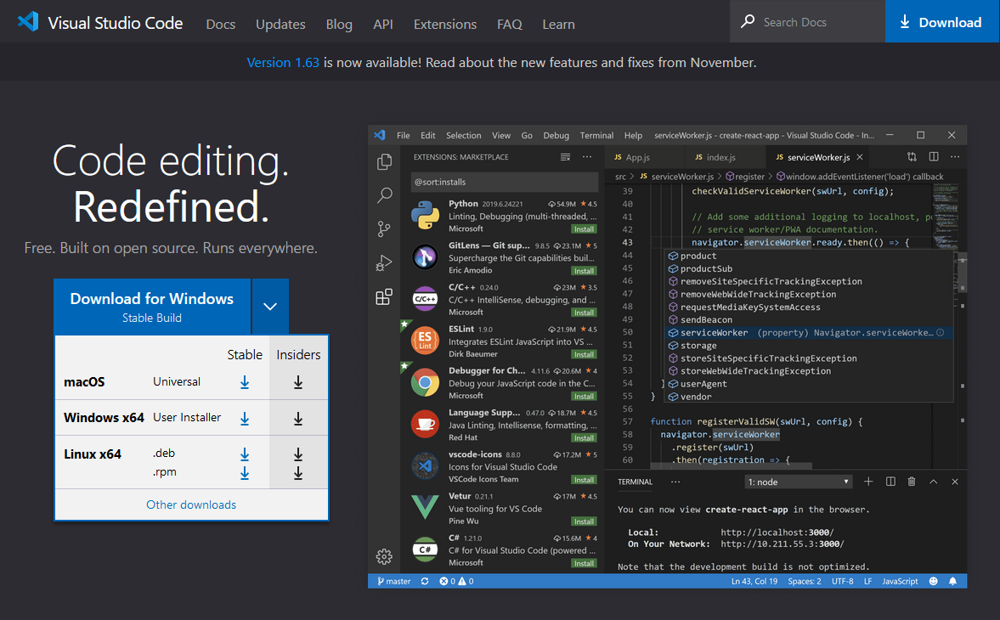
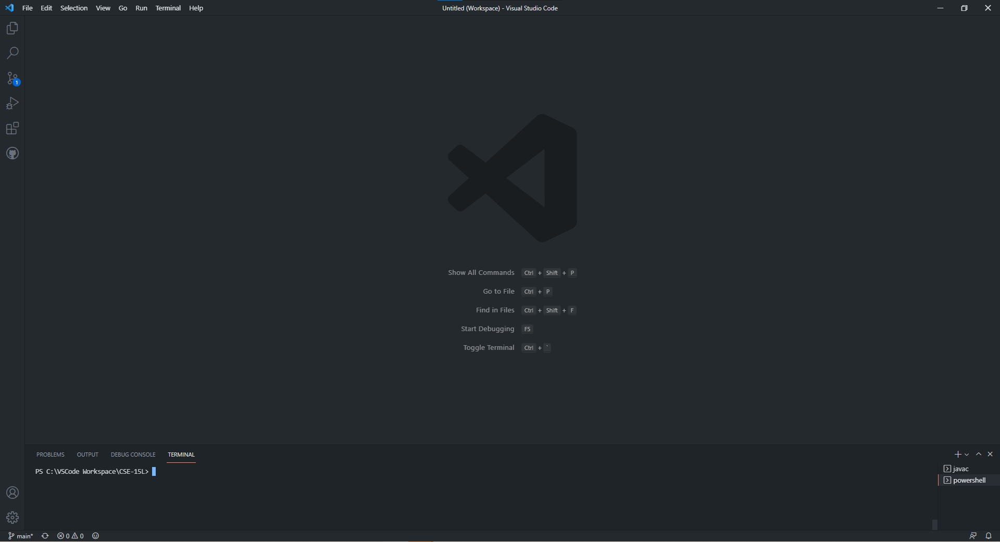
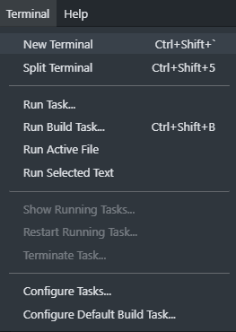

# Week 2 Lab Report
## Welcome new CSE 15L students!

## Table of Contents:
1. [Introduction](#introduction)
2. [Installing Visual Studio Code](#vscode)
3. [Remotely Connecting](#remote)
4. [Trying Some Commands](#commands)
5. [Moving Files With `scp`](#scp)
6. [Setting an SSH Key](#sshkey)
7. [Optimizing Remote Running](#optimize)

## **Introduction** <a name="introduction"></a>
Here is a guide on how to log on to your respective course-specific account on `ieng6`, which is a tool that you will need for this class! First, however, you will need to install Visual Studio Code.

---
## **Installing Visual Studio Code** <a name="vscode"></a>
To install Visual Studio Code, go to the [download website](https://code.visualstudio.com/) and follow the instructions for your respective operating system.



The webpage should look similar to the screenshot provided. Download the **stable** build for your operating system.

Once you have set up Visual Studio Code, your application should look something like this:



If your application does not have a Terminal tab open at the bottom like in the screenshot, open a new terminal by going to Terminal on the top left, and click "New Terminal".



---
## **Remotely Connecting** <a name="remote"></a>
Now that you have Visual Studio Code set up, you need to access your CSE 15L course specific account. If you are on Windows, install OpenSSH, which is a program that allows you to remotely connect to other computers.

[Install OpenSSH](https://docs.microsoft.com/en-us/windows-server/administration/openssh/openssh_install_firstuse)

Follow all of the steps provided **until** the "Start and Configure OpenSSH Server" section.

Once you have OpenSSH installed, find your course-specific account for CSE 15L [here](https://sdacs.ucsd.edu/~icc/index.php). Your username should look something like `cs15lwi22zz`, where `wi22` is the quarter and year, and `zz` is your specific identifier.

Once you have found your username, go back to Visual Studio Code, into your terminal, and type:

`ssh username` where username is your username that you just looked up.

If you have never connected to this server, you will get a message looking like this:

```
The authenticity of host 'ieng6.ucsd.edu (128.54.70.227)' can't be established.
RSA key fingerprint is SHA256:ksruYwhnYH+sySHnHAtLUHngrPEyZTDl/1x99wUQcec.
Are you sure you want to continue connecting (yes/no/[fingerprint])? 
```

Type in `yes`, press enter, and you will get a prompt to type in your password. Keep in mind, when you type in your password, it will not show up in the terminal, not even as dots. Once you have typed in your password, you should recieve a message looking like this:

```
============================ NOTICE =================================
Authorized use of this system is limited to password-authenticated
usernames which are issued to individuals and are for the sole use of
the person to whom they are issued.

Privacy notice: be aware that computer files, electronic mail and
accounts are not private in an absolute sense.  You are responsible
for adhering to the ETS Acceptable Use Policies, which you can review at:
https://blink.ucsd.edu/faculty/instruction/tech-guide/policies/ets-acceptable-use-policies.html
=====================================================================

*** Problems, Suggestions, or Feedback ***

    For help requests, please create a ticket at:
    https://support.ucsd.edu/its

    You may also report issues, suggestions, or feedback by e-mailing root on any system:
    mail -s "Your subject here" root
    Type your message - Ctrl+D to send

*** Access our Linux ssh terminals or remote desktops via a web browser at: ***
    https://linuxcloud.ucsd.edu

    All accounts must be enrolled in Duo for access. No VPN required.


-------------------------------------------------------

quota: No filesystem specified.
Hello cs15lwi22aqp, you are currently logged into ieng6-202.ucsd.edu

You are using 0% CPU on this system

Cluster Status 
Hostname     Time    #Users  Load  Averages  
ieng6-201   13:00:01   17  3.09,  3.14,  3.22
ieng6-202   13:00:01   10  1.08,  1.08,  1.06
ieng6-203   13:00:01   15  0.03,  0.12,  0.33


Thu Jan 13, 2022  1:00pm - Prepping cs15lwi22
```

Now, you should be connected to the CSE basement computers!

---
## **Trying Some Commands** <a name="commands"></a>

## **Moving Files with `scp`** <a name="scp"></a>

## **Setting an SSH Key** <a name="sshkey"></a>

## **Optimizing Remote Running** <a name="optimize"></a>